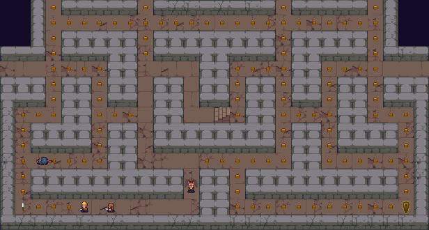

+++
title = "Labyrinth Sprint"
date = 2020-10-07
updated = 2020-11-03
description = "I've just launched my pacman and roguelike inspired arcade game Labyrinth Sprint on Kickstarter."

[taxonomies]
categories = ["Games"]
+++

Since leaving my job as a web developer at the start of lockdown I've been trying to teach myself game development and the Rust programming language. Being somewhat obsessed with classic RPGs I started learning how to make roguelikes, but then inspiration struck when I was out for one of my walks. I suffer from chronic back pain, and the thing that aggravates it more than anything else is remaining stationary for long periods of time; so unless it was absolutely bucketing it down I would be out everyday for the one hours' worth of exercise allowed under UK lock down rules.

I started wondering what it would be like if, instead of the turn-based, tactical nature of traditional roguelikes, you were forbidden from staying still and instead had to continually move. That then brought on thoughts of the movement system in a certain classic arcade game and Labyrinth Sprint was born.

It's now up on [Kickstarter](https://www.kickstarter.com/projects/360243327/labyrinth-sprint) hoping to raise enough funds to keep me clothed and fed until I can complete it.

It's been programmed in the Rust programming language and all the development has been done on a Linux machine. Once the game is released, I will open source the code in the hope that others may benefit from it. There are currently Linux and Windows demos you can try out now and they're both less than 2mb when zipped!

10% of all profits from the game will be contributed to some of the open source libraries that have helped me develop it. The graphics are paid assets and hopefully if I get some money through Kickstarter I can give the artist a nice bonus to say thank you.