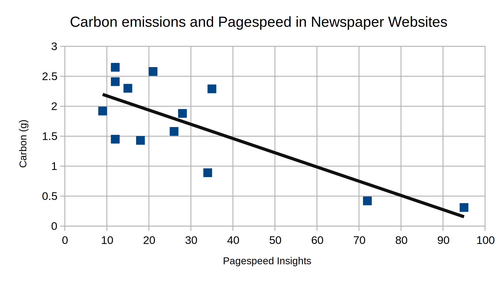

+++
title = "Faster websites are better for people and planet"
date = 2021-02-25
description = "A brief analysis on the relationship between pageload speed and carbon emissions."
[taxonomies]
categories = ["Web"]

# Custom data

[extra]
excerpt = "Website pagespeed and carbon emissions are closely linked, and a change in one often improves the other."
+++
The last few years have brought a steady stream of environmental disasters that have been made many times more likely because of man-made climate change[1](#f1), and we are all becoming increasingly aware of the lifestyle changes we need to make in order to ensure our species' future. One area where the environmental impact of our human activities can be less obvious, however, is in the digital realm. We have a tendency to think of things on the internet as not really being there as we cannot physically see them, but the infrastructure required to maintain the world wide web is vast. In order to view a web page, its content must be stored on a server somewhere. That data must then be transmitted from the server's physical location to the user's device, and the device must use that to render the page.

## Electricity

To power this transmission we require electricity, and the production of electricity also releases carbon into the atmosphere; in the initial construction of generating capacity and - in the case of fossil fuel based generation - in the production of the electricity itself. If we want to reduce the environmental impact of our websites, therefore, we need to minmise the amount of electricity that each page view requires.

As web developers, many of the changes that could contribute to this (such as increasing hardware efficiency and transmission speeds) are well outside of our area of expertise, but there are a couple of factors that we have a large amount of control over: reducing how hard a device needs to work to render a page, and minimising the amount of time it needs to work. Due to the sheer scale of the world wide web, even small reductions to the two can quickly add up to big differences in electricity usage.

## Pageload speed

I'm just old enough to remember patiently waiting for a page to load via a dial-up connection. Now that I am on fibre broadband I expect pages to load proportionally faster, and have a tendency to abandon those that seem intent on overwhelming me with nostalgia for 56 kbit/s downloads. A google study found that most other internet users share my feelings, and visitors to websites become increasingly likely to abandon them the longer they take to load[2](#f2). This is now taken into account with google's page rankings, with faster websites ranked higher than those which are slower[3](#f3).

It's probably safe to say that the objective of a website is for people to find it and interact with its contents. Having a fast website, therefore, is of great benefit to this aim as it increases the likelihood of visitors finding it on search engines, and reduces the number of people who subsequently give up on it before they have fully digested the content.

Website performance optimization is an incredibly broad topic that covers a lot of different strategies, but it can be broadly broken down into getting the page data to the browser as quickly as possible, and minimising the amount of time needed to render it. Interestingly, those goals are almost identical to those we have in reducing carbon emissions. We could, in fact, think of them as two sides of the same coin; many of the changes we make to improve one, will also have a positive impact on the other.

## Measurement

While this relationship is all well and good in theory, it is always better to support a theory with real-world data. If we could plot the relationship between pageload speed and carbon emissions with real world websites, we would have a better idea of any correlation between the two.

Last year, I performed a basic analysis of several different metrics on the websites of some of the most popular British Newspapers[4](#f4). Two of the metrics that I recorded were the Mobile Pagespeed Insights scores, and the Carbon Emissions[5](#f5). Extracting those two metrics from the analysis we are left with the following data:

{{ table(path="content/blog/2021-02-25-faster-websites/results.json") }}

Which when plotted onto a scatter graph shows the following trend:

<figure class="inline">
    
</figure>

Obviously, this is from a very small sample size (made even smaller by not being able to include those sites which returned NaN for one of the values) and is heavily skewed towards slow and dirty pages. More data is required to draw definitive conclusions, nevertheless, there does seem to be a correlation between high pagespeed and low emissions.

### Measuring changes

Another area that would help to support this theory would be comparing both scores after work to improve one or the other. One of my hobbies is programming games in the Rust Programming language, and one of the best sites providing resources for the Rust Gamedev community is <a href="https://arewegameyet.rs/">arewegameyet.rs</a>. While poking around on the website I noticed that - while their desktop performance was very good - the mobile performance had some room for improvement, and opened a pr with some changes to boost performance. As the site is generated via a <abbr title="Static Site Generator">SSG</abbr>, I was able to go back later and publish before and after versions for measurement of carbon emissions. The result of this comparison is below:

{{ table(path="content/blog/2021-02-25-faster-websites/arewegame.json") }}

While working on the changes I was not measuring or accounting for carbon emissions, and all my improvements were aimed solely at increasing pageload performance. In spite of this, the carbon emissions also improved, with a very close percentage change (though negative as smaller carbon emissions are better).

## Conclusion

While all of the data presented are from very small sample sizes, a trend should already be noticeable and support the logical assetions that page speed and carbon emissions are closely linked. Even with much larger data sets I would expect to see only a weak correlation, as there will inevitably be some improvements to either factor that will have little or no effect on the other (such as switching to a renewable energy host not improving pageload speed).

Hopefully, what I have shown should provide food for thought and demonstrate that many areas in web development are closely related; with improvements in one also bringing about similar improvements in others. It should also demonstrate that faster websites are better for everyone; users, website owners, and everything else that lives on planet Earth.

If you have found this article enlightening or infuriating please let me know. Also, if you would like to share your own experiences trying to improve the environmental impact of websites I'd love to hear from you.

### Footnotes

<ol>
    <li id="f1"><a href="https://www.ucsusa.org/resources/climate-change-and-wildfires">The Connection Between Climate Change and Wildfires</a>, <a href="https://www.newscientist.com/article/mg24933223-900-covid-19-is-a-wake-up-call-to-stop-abusing-the-ecosystems-we-depend-on/">Covid-19 is a wake-up call to stop abusing the ecosystems we depend on</a>, <a href="https://www.gov.uk/government/news/climate-change-means-more-frequent-flooding-warns-environment-agency">Climate change means more frequent flooding, warns Environment Agency</a></li>
    <li id="f2"><a href="https://econsultancy.com/slow-loading-websites-cost-retailers-1-73bn-in-lost-sales-each-year/">Slow-loading websites cost retailers £1.73bn in lost sales each year</a></li>
    <li id="f3"><a href="https://developers.google.com/search/blog/2020/11/timing-for-page-experience">Timing for bringing page experience to Google Search</a></li>
    <li id="f4"><a href="https://pinopticon.net/blog/carbon-and-pagespeed-better-web-edition/">Carbon and pagespeed in newspaper websites</a></li>
    <li id="f5">As reported by the <a href="https://www.websitecarbon.com/">Website Carbon Calculator</a></li>
</ol>