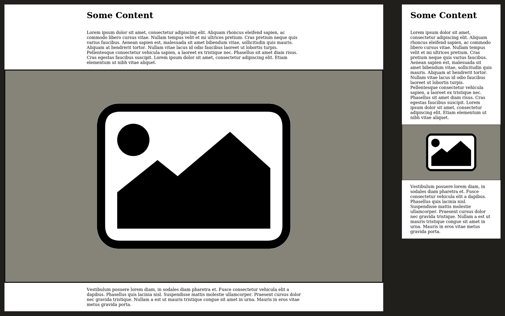

+++
title = "Media query-less centred content with grid."
date = 2021-03-12
description = "Centring content on desktop without media queries using css grid."
[taxonomies]
categories = ["Web"]
+++
<div class="full-bleed">

An increasingly popular approach to laying out webpages is to restrict the width of the page content, and have it remain centred on wider screens. This way lines of text don't become too long for reading, and there is not too much whitespace at the page edges on smaller devices. Like anything in web development, there are several ways of implementing this, but most rely on media-queries and additional wrapping `div`s. With the widespread browser adoption of CSS Grid, however, I have been experimenting with a way of achieving this which does not rely on altering html structure or media-queries, and also allows some chosen elements to stretch to the full width of the device.

## What we're creating
Before covering the specifics of implementation, we should look at a simple example of the layour we're trying to achieve. You've probably come across many websites that use this technique, but a screenshot of our example is below to clarify what we will be aiming for:

<figure>
    
</figure>

As you can see the page content on a mobile viewport runs almost to the edge of the screen, whereas on desktop it has a much wider padding on each side. In both cases the image is the full width of the screen. The content will continue to resize with the screen until it reaches a set threshold, after which it will remain centred in the screen at that width.

## Starting HTML
For this simple example we will work with a page that has a single heading, two paragraphs and an image that will stretch to the full width of the screen. The HTML for which is:

```
<!doctype html>
<html lang="en">
    <head>
        <meta charset="utf-8"/>
        <meta content="width=device-width, initial-scale=1, shrink-to-fit=no" name="viewport"/>
        <title>Centred Content</title>
        <link href="./style.css" rel="stylesheet"/>
    </head>
    <body>
        <main>
            <h1>Some Content</h1>
            <p>Lorem ipsum dolor sit amet, consectetur adipiscing elit. 
            Aliquam rhoncus eleifend sapien, ac commodo libero cursus vitae. 
            Nullam tempus velit et mi ultrices pretium. Cras pretium neque quis varius faucibus. 
            Aenean sapien est, malesuada sit amet bibendum vitae, sollicitudin quis mauris. 
            Aliquam at hendrerit tortor. Nullam vitae lacus id odio faucibus laoreet ut lobortis turpis. 
            Pellentesque consectetur vehicula sapien, a laoreet ex tristique nec. Phasellus sit amet diam risus. 
            Cras egestas faucibus suscipit. Lorem ipsum dolor sit amet, consectetur adipiscing elit. 
            Etiam elementum ut nibh vitae aliquet.</p>

            

            <p>Vestibulum posuere lorem diam, in sodales diam pharetra et. 
            Fusce consectetur vehicula elit a dapibus. Phasellus quis lacinia nisl. 
            Suspendisse mattis molestie ullamcorper. Praesent cursus dolor nec gravida tristique. 
            Nullam a est ut mauris tristique congue sit amet in urna. 
            Mauris in eros vitae metus gravida porta.</p>
        </main>
    </body>
</html>
```

Many previous solutions to this layout would require applying padding directly to the body, or adding another `div` around the content, but with grid we can maintain clean HTML. We will also start with some basic CSS to reset default browser properties:

```
html {
    box-sizing: border-box;
}

*,
*:before,
*:after {
    box-sizing: inherit;
}

body {
    margin: 0 auto;
}
```

Which should give us a page looking like this:
<figure>
    
</figure>

## Adding grid
The first step to our layout is to make the `main` element a grid container. We then set it to have 3 columns, the centre column for content, and one on each side for padding.

```
main {
    display: grid;
    grid-template-columns: 2rem 1fr 2rem;
    grid-auto-rows: auto;
}
```

If we were to refresh the page now, of course, grid's default layout rules will mean that it will try and lay out the `main` element's children in all of the columns; including the 2rem wide ones we added for padding. This will result overlapping elements and the general chaos illustrated in the below screenshot.
<figure>
    
</figure>

## Positioning elements correctly
To rectify this we can instruct the browser on where to position all child elements of `main` on the grid:

```
main > * {
    grid-column: 2 / span 1;
}

main > .full-bleed {
    grid-column: 1 / span all;
}
```
By using the `main > *` selector we are declaring that all children of `main` should be laid out starting on the second column line, and spanning a single column. Anything with the `.full-bleed` class will then be laid out starting on the first column line, and spanning all columns (effectively spanning the whole width of their parent). The page should now render like so:
<figure>
    
</figure>

## Adding a maximum content width
While this layout will work fine on smaller devices, the horizontal padding of content remains always at 2rem. Essentially we have used grid to hack a layout we could easily have achieved with padding and a negative margin on the `full-bleed` elements. It would be possible to override the `grid-template-columns` value on `main` in a media-query, but grid supports a `max` value that can do the calculation automatically. To set this up we change the rulset for `main`:

```
main {
    display: grid;
    grid-template-columns: max(2rem, (100% - 80ch) / 2) 1fr max(2rem, (100% - 80ch) / 2);
    grid-auto-rows: auto;
}
```

What we have done here is to replace the 2rem value for the outer grid columns with a `max` calculation. Max takes two values, seperated by commas, and uses whichever calculates as the higher. The right hand side calculation (`(100% - 80ch) / 2`) looks rather complex, so lets break to down. For the purposes of the example we will assume a screen width of 1200px:
- The value of 100% refers to the total width of the element. In the case of our simple example that is the total-width of the screen, 1200px. So the calculation becomes `(1200px - 80ch) / 2`.
- The value of 80ch is the maximum width we want the content to extend to. `ch` is the width of the number `0` in whichever font you are using, so can be used to set a width which is an approximate number of characters. In our case, by taking this away from 100%, we are saying that we want the side columns to be whatever is left of the screen after our maximum content width has been removed (1200px - 1006px in our example).
- Finally the we divide this value by 2 as there are 2 outer columns (leaving each a computed value of 503.167px).
- On smaller screens where this calculation is less than 2rem, the max function will set the column width to 2rem.
- As the centre column has a width of 1fr, it will automatically expand to fill whatever space is left.

When we apply the above styling to our page it should now look like this:
<figure>
    
</figure>

## Conclusion
One advantage of this technique is that, because it does not use vw units, it will also work in cases where there are one or more sidebars and the `main` element does not use up all of the screen. The lack of a media query also means you can set the preferred content width once, and not have to worry about it if the page-layout changes in future.

There are probably many other ways of achieving this, but hopefully it might help you in your own website layouts. If you have a better way of doing this please let me know as I'm always keen to improve and simplify my stylesheets.

</div>